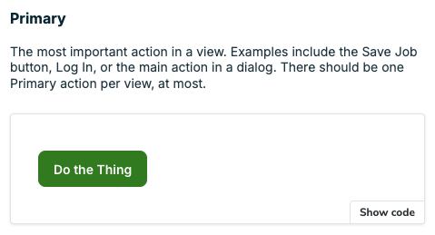
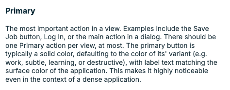

import { Meta } from "@storybook/addon-docs";

<Meta title="Guides/Documentation styleguide" />

# Documentation styleguide

## Purpose

We should write clear, consistent docs to create a coherent experience for our
consumers.

## Foundational principles

### Minimum viable correctness

Less is more. The more we write, the more we must maintain.

| **✅ Do**                                                         | **❌ Don't**                                           |
| :---------------------------------------------------------------- | :----------------------------------------------------- |
| Provide the minimum amount of information necessary to be correct | Attempt to preempt every possible question or use case |

Atlantis docs can be updated to reflect questions that consumers bring to the
team, or changes in the system as it evolves.

### Document for Jobber

Follow Atlantis formatting, voice & tone, and vocabulary for written content.

| **✅ Do**                                                         | **❌ Don't**                                           |
| :---------------------------------------------------------------- | :----------------------------------------------------- |
| Provide the minimum amount of information necessary to be correct | Attempt to preempt every possible question or use case |

Component and design examples should be realistic and relevant to Jobber.

| **✅ Do**                                                 | **❌ Don't**                               |
| :-------------------------------------------------------- | :----------------------------------------- |
| Use UI examples and sample data relevant to home services | Insert your favourite fictional characters |

As tempting as it is to use characters from
`{your favourite sci-fi/fantasy series}` into a component example, not everyone
consumes the same media as you and the reference may not be understood.

### Show over tell

Embed `Stories` inline, share working code snippets, and use clear **✅ Do** /
**❌ Don't** examples to give people what they need with less effort.

| **✅ Do**                                      | **❌ Don't**                                     |
| :--------------------------------------------- | :----------------------------------------------- |
|  |  |

### Use hierarchy to guide the reader

Clearly distinguish code-specific guidance from conceptual guidance so consumers
can find what they're looking for without feeling overwhelmed.

| **✅ Do**                    | **❌ Don't**                  |
| :--------------------------- | :---------------------------- |
| **Design guidance**          | **Design guidance**           |
| -> When to use               | -> When to use                |
| -> Related components        | **Callbacks**                 |
| -> Content guidelines        | **Related components**        |
| -> Accessibility             | -> Accessibility              |
| **Implementation guidance**  | **Controlled vs uncontroled** |
| -> Props                     | **Responsiveness**            |
| -> Callbacks                 | **Component composition**     |
| -> Component composition     | -> Props                      |
| -> Controlled vs uncontroled |                               |
