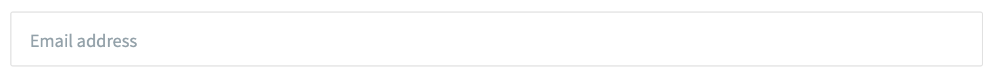
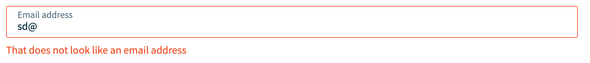
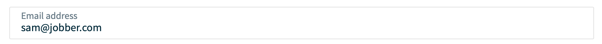

# `InputEmail`

The `InputEmail` component helps a user enter a valid email address.

## Design Patterns

- Built-in validation provides the user with feedback on whether their input is
  a well formed email address. There will be default placeholder content and
  validation messages provided that the user can override.
- The component validation will follow the Altantis patterns for consistency.
- The component will be modeled after
  [InputNumber](https://atlantis.getjobber.com/components/input-number) to gain
  consistency and support for:
  - wrapping `FormField` and passing its props and validations through to it;
  - exposing a ref that allows for `blur()` and `focus()`;
  - supporting controlled and uncontrolled uses, size setting, and inline
    presentation modes.

## Accessibility

- All text should get read by screen readers.
- Error messages from invalid input should be coded with right ARIA supports so
  that state changes and validation errors are presented at the right time (e.g.
  screen reader announces error).
- We will look to meet the following guidelines with one or possibly both of the
  following:
  - [Using Aria-Invalid to Indicate An Error Field](https://www.w3.org/WAI/WCAG21/Techniques/aria/ARIA21.html)
  - [Using ARIA role=alert or Live Regions to Identify Errors](https://www.w3.org/WAI/WCAG21/Techniques/aria/ARIA19.html)

## Responsiveness & Mobile

- The component will ultimately use a web standard HTML `<input>` element with
  attribute `type="email"` (by wrapping `FormField`). This is important to
  render a more specific e-mail keyboard on mobile.

## Wireframe

### Blank

An input, with nothing touched yet (defaults):



### Error, Invalid email

An input with an invalid email address in it.



### Valid email

An input, with a valid email address in it.



## Interface

```ts
import { InputEmail } "@jobber/components/InputEmail";
```

```tsx
<Playground>
  {() => {
    const [value, setValue] = useState("");
    return (
      <InputEmail value={email}  onChange={setValue} />
    );
  }
</Playground>
```

### Essentially it will be this:

```tsx
() => {
  return (
    <>
      <Text>
        <InputText
          placeholder="Email address"
          validations={{
            required: {
              value: true,
              message: "Please tell me your name",
            },
            pattern: {
              value:
                /\A((?:(?:(?:[a-zA-Z0-9\-+_][.\-+_'&]?)*)[a-zA-Z0-9\-+_]))@((?:(?:(?:[a-zA-Z0-9][.\-_]?){0,62})[a-zA-Z0-9])+)\.([a-zA-Z0-9]{2,})\z/,
              message: "That does not look like an email address",
            },
          }}
          name="myName"
        />
      </Text>
    </>
  );
};
```

## Props Table

| name           | type                  | default   | description                                                                                       |
| -------------- | --------------------- | --------- | ------------------------------------------------------------------------------------------------- |
| `defaultValue` | `string?`             | undefined | Value for an [uncontrolled input](https://reactjs.org/docs/uncontrolled-components.html).         |
| `value`        | `string?`             | undefined | Value for an [controlled input](https://reactjs.org/docs/forms.html#controlled-components).       |
| `onChange?`    | `(newValue?: string)` | undefined | Callback function for value change. If the input date is not valid this should return `undefined` |

This component will also subsume the same props as `FormField`.
