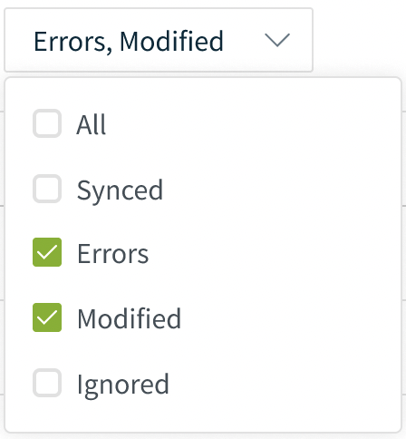

# `MultiSelect`

The `MultiSelect` component gives our users the possibility to select multiple
options from a menu.

## Design Patterns

The goal of the `MultiSelect` component is to allow a suer to check multiple
options within a list of items.

A user can click on the element to expand it and display the multiple options.
The element will display the selected options or the placeholder text if none
are selected.

Every time an option is checked or unchecked a behavior can be triggered using
the onChange prop

### How it might behave:

- This multi-select dropdown matches the designs seen in the Figma here

- Developer should have props for whether or not an “All” checkbox should show
  up at the top, as well as the text that should display in this option

  - The “All” checkbox should be indeterminate

    - If it’s currently unchecked and the user checks it then all of the lower
      options should be checked automatically

      - If unchecked again after that then all of the lower options should be
        unchecked automatically

    - The “All” checkbox is automatically marked checked if the user manually
      checks all of the options below it

    - The “All” checkbox is automatically marked unchecked if the user manually
      unchecks all of the options below it

- The text that appears in the box before a user clicks on it should be either
  “All **\_\_\_\_**” or a comma separated list of the current selections

## Accessibility

- Users should be able to use their keyboard and toggle the component's click
  event to display the options
- Users should be able to use their keyboard to navigate through the options and
  check/uncheck them
- Include `aria-expanded` attribute on the trigger to communicate to assistive
  technology
- The trigger contains a downward-pointing-arrow to hint that it can be
  expanded.

## Responsiveness

On mobile devices the interaction behaviour would be the same as a mouse with
touch/click. The component should adapt to different screen sizes the same as an
html select would.

## Interface

```ts
import { MultiSelect } from "@jobber/components/MultiSelect";
```

```ts
<Playground>
  {() => {
    const items = [
      {
        label: "Synced",
        checked: false,
      },
      {
        label: "Errors",
        checked: true,
      },
      {
        label: "Modified",
        checked: true,
      },
      {
        label: "Ignored",
        checked: false,
      },
    ];

    return (
      <MultiSelect items={items} />
    );
  }
</Playground>
```

## Mockup



## Props Table

| name                | type                  | default   | description                                                                                                            |
| ------------------- | --------------------- | --------- | ---------------------------------------------------------------------------------------------------------------------- |
| `items`             | `Array?`              | undefined | An associative array that represents the labels and values that are to be associated with each option, and determines. |
| `noneSelectedLabel` | `String?`             | undefined | The text that will be displayed when no options are selected.                                                          |
| `allSelectedLabel`  | `String?`             | undefined | The text that will be displayed when all options are selected.                                                         |
| `onChange?`         | `(newValue?: string)` | undefined | Callback function for value change.                                                                                    |
