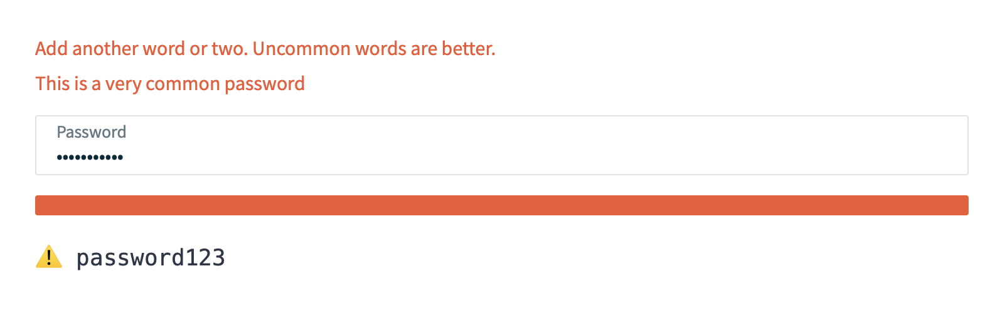

import { Playground, Props } from "docz";
import { ComponentStatus } from "@jobber/docx";
import { useState } from "react";
import { PasswordEditor } from ".";

# Password Editor

<ComponentStatus stage="pre" responsive="no" accessible="no" />

PasswordEditor allows you to gauge and display the strength of a password input
by the user.

```ts
import { PasswordEditor } from "@jobber/components/PasswordEditor";
```

<Playground>
  {() => {
    const [[password, secure], setPassword] = useState(["", false]);
    return (
      <>
        <PasswordEditor value={password} onChange={setPassword} />
        <pre>
          {secure ? "✅" : "⚠️"} {password}
        </pre>
      </>
    );
  }}
</Playground>

## Props

<Props of={PasswordEditor} />

---

## _Welcome To_


---

## What are we building?



_And Tests!_

---

## The starting point

Seed Branch: _TrainingDay_

Take a look…

[https://github.com/GetJobber/atlantis/tree/TrainingDay/packages/components/src/PasswordEditor](https://github.com/GetJobber/atlantis/tree/TrainingDay/packages/components/src/PasswordEditor)

---

## The tests are our guide

```
npm test -- packages/components/src/PasswordEditor/PasswordEditor.test.tsx
```

1. `○ skipped renders with custom placeholder`
1. `○ skipped it should call the handler with a new secure value`
1. `○ skipped it should call the handler with a new insecure value`
1. `○ skipped renders an error message when given an insecure value`
1. `○ skipped renders`

---

## Helpful Commands

- **Starting Atlantis:** `npm start`
- **Running Tests:**
  `npm test -- packages/components/src/PasswordEditor/PasswordEditor.test.tsx`
- **Updating snapshots:**
  `npm test -- -u packages/components/src/PasswordEditor/PasswordEditor.test.tsx`

---

## Note: Relative import within Atlantis

Normally import components _from Atlantis_:

```
  import { Content } from "@jobber/components/Content";
```

While in Atlantis however:

```
  import { Content } from "../Content";
```

We plan to streamline in the future.

---

## Helpful Links

- [React Docs](https://reactjs.org/docs/introducing-jsx.html)
- [Typescript Handbook](https://www.typescriptlang.org/docs/handbook/basic-types.html)
- [Array / Object Destructuring](https://developer.mozilla.org/en-US/docs/Web/JavaScript/Reference/Operators/Destructuring_assignment)
- [Test Guiding Principles](https://testing-library.com/docs/guiding-principles)
- [Test Element Queries](https://testing-library.com/docs/dom-testing-library/api-queries#queryby)

<!--
  It is not necessary to provide an example of each prop. Use usage examples to
  highlight key features of a component or particular considerations.

  See `Button.mdx` for a good example of this.
-->
